# Mini-Projet : Conteneurisation d'une Application avec Docker

## Description
Ce projet a pour objectif de conteneuriser une application existante en utilisant Docker. L'application comprend :
- Un backend en **Python** utilisant **Flask**
- Un frontend en **PHP** permettant l'affichage des étudiants

Le but est d'améliorer le déploiement et l'évolutivité de l'application en utilisant **Docker** et **Docker Compose**.

---
## Objectifs du Projet
### Objectifs Pratiques :
- **Maîtriser Docker** : Construire et exécuter des conteneurs
- **Gestion des versions** : Versionner les images et gérer leur stockage
- **Infrastructure as Code (IaC)** : Automatiser le déploiement avec Docker Compose
- **Sécurité** : Assurer un déploiement sécurisé

---
## Contexte
SUPMIT, une entreprise de développement de logiciels pour les universités, souhaite améliorer son infrastructure afin de garantir une meilleure automatisation et évolutivité.

L'application existante fonctionne actuellement sur un serveur unique et nécessite une solution conteneurisée pour améliorer l'agilité du déploiement.

---
## Infrastructure
- Un serveur avec **Docker** installé
- Deux services conteneurisés :
  - **API REST (Flask)** : Gère et retourne la liste des étudiants
  - **Application web (PHP)** : Interface utilisateur permettant d'afficher la liste des étudiants
- **Un registre Docker privé** pour stocker les images créées

---
## Structure du Projet
```
.
├── simple_api/
│   ├── Dockerfile
│   ├── requirements.txt
│   ├── student_age.py
│   ├── student_age.json
│
├── website/
│   ├── index.php
│
├── docker-compose.yml
├── docker-compose-registry.yml
├── README.md
```

---
## Installation et Déploiement
### 1. Construire et Tester l'API
 
Le Dockerfile de l'API est construit à partir de l'image Python 3.8 et inclut:

 - Installation des dépendances système nécessaires
 - Configuration d'un volume pour les données persistantes
 - Exposition du port 5000
 - Configuration de l'authentification basique

#### Étapes :
1. **Construire l'image Docker** :

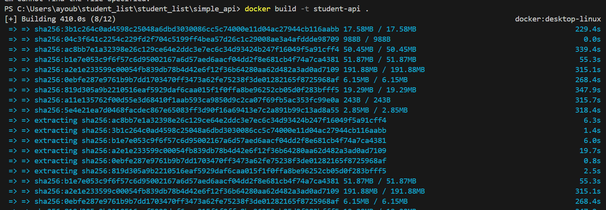

Explication ::  
La commande ***docker build -t student-api*** . génère une image Docker appelée student-api en téléchargeant, extrayant et assemblant les différentes couches nécessaires pour son exécution.

  **docker build** : Cette commande est utilisée pour créer une image Docker à partir d'un fichier Dockerfile situé dans le répertoire actuel.
  
  **-t student-api** : L'option -t (tag) est utilisée pour donner un nom (tag) à l'image Docker. Ici, l'image créée sera nommée student-api.
  
  **.** : Le point (.) indique que le contexte de construction est le répertoire actuel. Cela signifie que Docker va chercher le Dockerfile et tous les fichiers   nécessaires dans ce répertoire.

  ***Voilà le résultat sur Docker Desktop:***

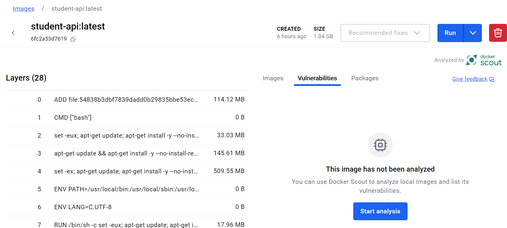

  

2. **Lancer le conteneur** :
   
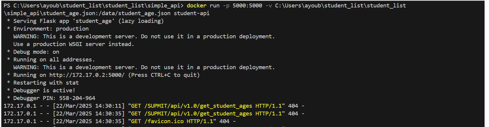

Explication ::: 
cette commande nous permet d'exécuter un conteneur à partir de notre image construite "student_api".

**docker run** : Cette commande exécute un conteneur Docker à partir d'une image.

**-p 5000:5000** : Cette option mappe le port 5000 du conteneur au port 5000 de l'hôte. Cela signifie que l'application à l'intérieur du conteneur sera accessible via http://localhost:5000 ou http://172.17.0.2:5000 (adresse interne du conteneur).

**-v C:\Users\ayoub\student_list\student_list\simple_api\student_age.json:/data/student_age.json** : Cette option monte un volume (liaison entre un fichier de l’hôte et un fichier du conteneur).

Le fichier ***student_age.json*** situé sur l’hôte (Windows) est monté à l’emplacement /data/student_age.json à l’intérieur du conteneur.

Cela permet au conteneur d’accéder aux données du fichier sans avoir besoin de l'inclure dans l'image Docker.

***student-api*** : C'est le nom de l'image Docker à partir de laquelle le conteneur est créé et exécuté

  ***Voilà le résultat sur Docker Desktop:***

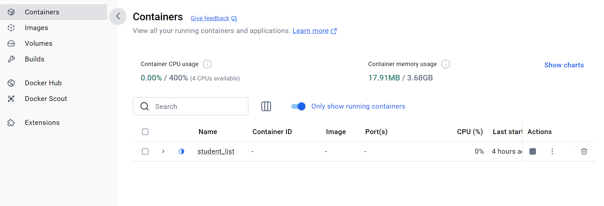

3. **Tester l'API** :


4. **Tester l'API dans le browser avec le credentials fournit dans le code "root:root"** :
   
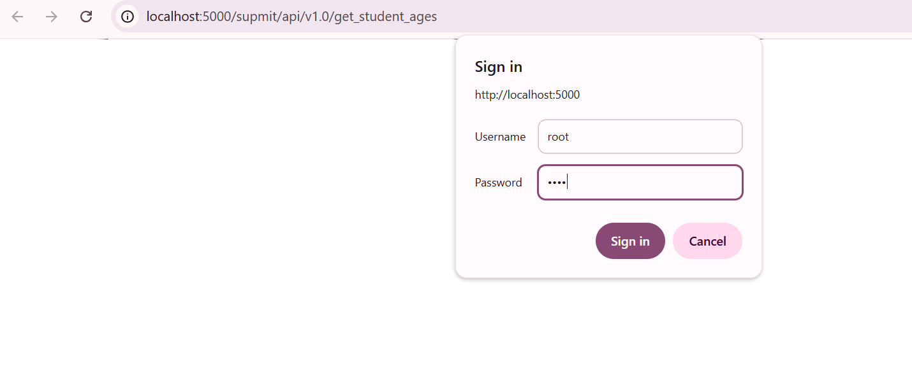
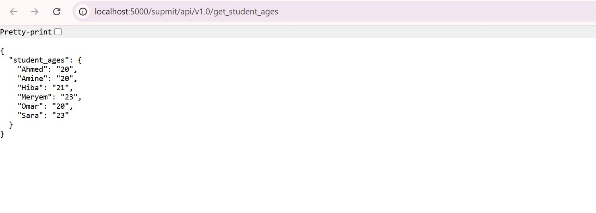
**EXPLICATION** :  
  Après avoir testé sur le port, on remarque que le résultat contenu sur "student_age.json" . 

### 2. Déploiement avec Docker Compose  

  Docker Compose est un outil puissant qui permet de définir et de gérer des applications multi-conteneurs Docker à l'aide d'un fichier YAML (`docker-compose.yml`). Cette solution :

- Simplifie considérablement le déploiement d'applications complexes
- Automatise la création, la configuration et l'orchestration des conteneurs
- Facilite le développement et les tests dans des environnements reproduisibles
- Permet de définir l'ensemble de l'infrastructure comme du code

  #### 2.1 Description des services

##### Service API (supmit_api)
- Basé sur l'image personnalisée `student-api`
- Expose le port 5000 pour les requêtes API
- Monte un volume local contenant le fichier `student_age.json` pour la persistance des données
- S'exécute dans le réseau `mynetwork`

##### Service Web (website)
- Utilise l'image officielle `php:apache` pour héberger un site web
- Variables d'environnement prédéfinies (`USERNAME` et `PASSWORD`) pour l'authentification
- Dépend du service API (s'assure que l'API démarre d'abord)
- Expose le site sur le port 8081
- Monte les fichiers du projet via un volume local
- Partage le même réseau que l'API pour permettre la communication inter-services

#### 2.2 Lancement des conteneurs

Pour démarrer l'ensemble de l'infrastructure, on a utiliser la commande suivante à la racine du projet :


Explication:  
docker-compose: Outil pour orchestrer plusieurs conteneurs  
up: Crée et démarre les conteneurs définis dans docker-compose.yml  
-d: Mode détaché (background) - les conteneurs continuent de fonctionner même si vous fermez le terminal  

L'option `--build` permet de reconstruire les images si nécessaire avant de lancer les conteneurs.


3. **Accéder à l'application** :  
   
   - **API** : `http://localhost:5000` 
   - **Interface Web** : `http://localhost:8081`
      - Affiche les données des étudiants stockées dans le fichier JSON

     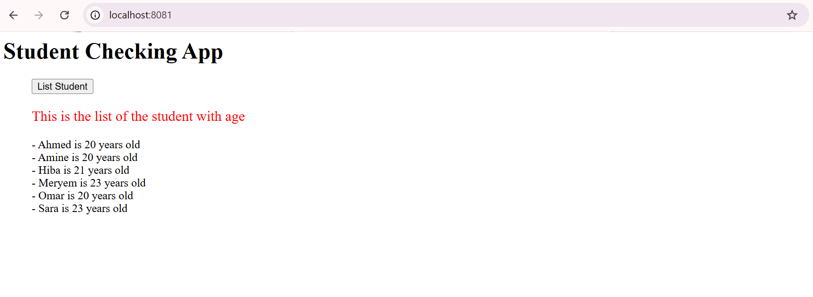
     *Liste des étudiants affichée par l'interface web PHP*

---

### 3. Docker Compose Registry

docker-compose-registry.yml
Ce fichier déploie:
 - Un *registre Docker privé* pour stocker les images
 - Une *interface web* pour visualiser et gérer les images dans le registre

#### Étapes :

1. **Déployer le registre privé avec**:
   
   Avant de commencer, il faut lancer le registre Docker privé avec **Docker Compose**.
   
     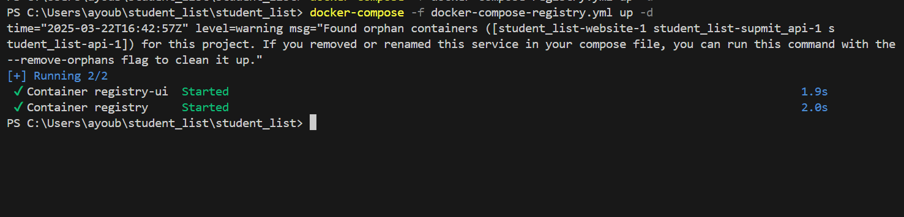
   
2. **Ajouter le tag** :
   
    Avant d’envoyer une image vers notre registre privé, nous devons lui attribuer un tag correspondant à l’URL du registre.
   
      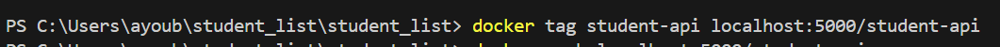
   
    **Explication** :  
       -student_api : Nom de l’image Docker créée  
       -localhost:5001/student_api : Tag pour associer l’image à notre registre privé  
   
3. **Pousser l'image crée vers le registre privé** :
   
    Maintenant que l’image a un tag, nous pouvons l’envoyer vers notre registre privé.
   
     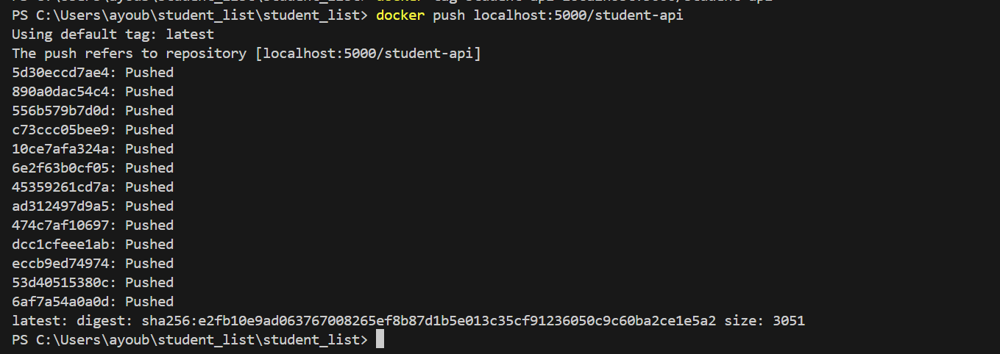   

4. **tester la présence de notre image  en registre privé** :
   
    Une fois l’image poussée, nous pouvons vérifier qu’elle est bien stockée dans le registre privé avec :   
   
      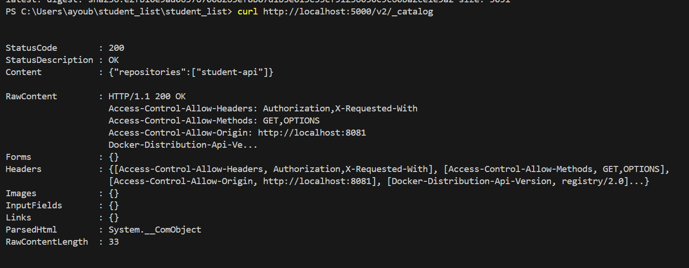  

 ## Conclusion
 
Grâce à ces étapes, vous avez maintenant un registre Docker privé opérationnel où vous pouvez stocker et gérer vos images localement. Vous pouvez également utiliser l'interface web associée pour naviguer plus facilement parmi les images disponibles.

## Auteurs
- **Mohammed Reda kadiri**
- **Ayoub Jarhni**
- **Zakaria El hajjam**

---
## Licence
Ce projet est sous licence MIT.

