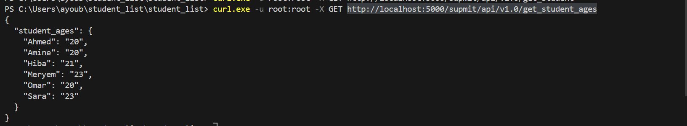

# Mini-Projet : Conteneurisation d'une Application avec Docker

## Description
Ce projet a pour objectif de conteneuriser une application existante en utilisant Docker. L'application comprend :
- Un backend en **Python** utilisant **Flask**
- Un frontend en **PHP** permettant l'affichage des étudiants

Le but est d'améliorer le déploiement et l'évolutivité de l'application en utilisant **Docker** et **Docker Compose**.

---
## Objectifs du Projet
### Objectifs Pratiques :
- **Maîtriser Docker** : Construire et exécuter des conteneurs
- **Gestion des versions** : Versionner les images et gérer leur stockage
- **Infrastructure as Code (IaC)** : Automatiser le déploiement avec Docker Compose
- **Sécurité** : Assurer un déploiement sécurisé

---
## Contexte
SUPMIT, une entreprise de développement de logiciels pour les universités, souhaite améliorer son infrastructure afin de garantir une meilleure automatisation et évolutivité.

L'application existante fonctionne actuellement sur un serveur unique et nécessite une solution conteneurisée pour améliorer l'agilité du déploiement.

---
## Infrastructure
- Un serveur avec **Docker** installé
- Deux services conteneurisés :
  - **API REST (Flask)** : Gère et retourne la liste des étudiants
  - **Application web (PHP)** : Interface utilisateur permettant d'afficher la liste des étudiants
- **Un registre Docker privé** pour stocker les images créées

---
## Structure du Projet
```
.
├── simple_api/
│   ├── Dockerfile
│   ├── requirements.txt
│   ├── student_age.py
│   ├── student_age.json
│
├── website/
│   ├── index.php
│
├── docker-compose.yml
├── docker-compose-registry.yml
├── README.md
```

---
## Installation et Déploiement
### 1. Construire et Tester l'API
#### Étapes :
1. Construire l'image Docker :


Explication ::
En utilisant cette commande on construit l'image à partir du dockerFile qu'on a crée 

2. Lancer le conteneur :

Explication ::: 
cette commande nous permet d'exécuter un conteneur à partir de notre image construite "student_api"
3. Tester l'API :



EXPLICATION :
Cette commande nous permet de tester l'API , et voilà le résultat est réussi .   
---
### 2. Déploiement avec Docker Compose
1. Modifier `index.php` pour configurer l'URL de l'API
2. Lancer les services avec Docker Compose :
```sh
docker-compose up -d
```


3. Accéder à l'application :
   - **API** : `http://localhost:5000`
   - **Interface Web** : `http://localhost:8080`

---
### 3. Docker Registry
1. Déployer le registre privé avec :


2. Ajouter le tag
    
3. Pousser l'image crée vers le registre privé :
 
4. tester la présence de notre image  en registre privé :
 


## Captures d'Écran
Ajoutez ici des captures d'écran des tests de votre API et interface web.


---
## Auteurs
- **Mohammed Reda kadiri**
- **Ayoub Jarhni**
- **Zakaria El hajjam**

---
## Licence
Ce projet est sous licence MIT.

